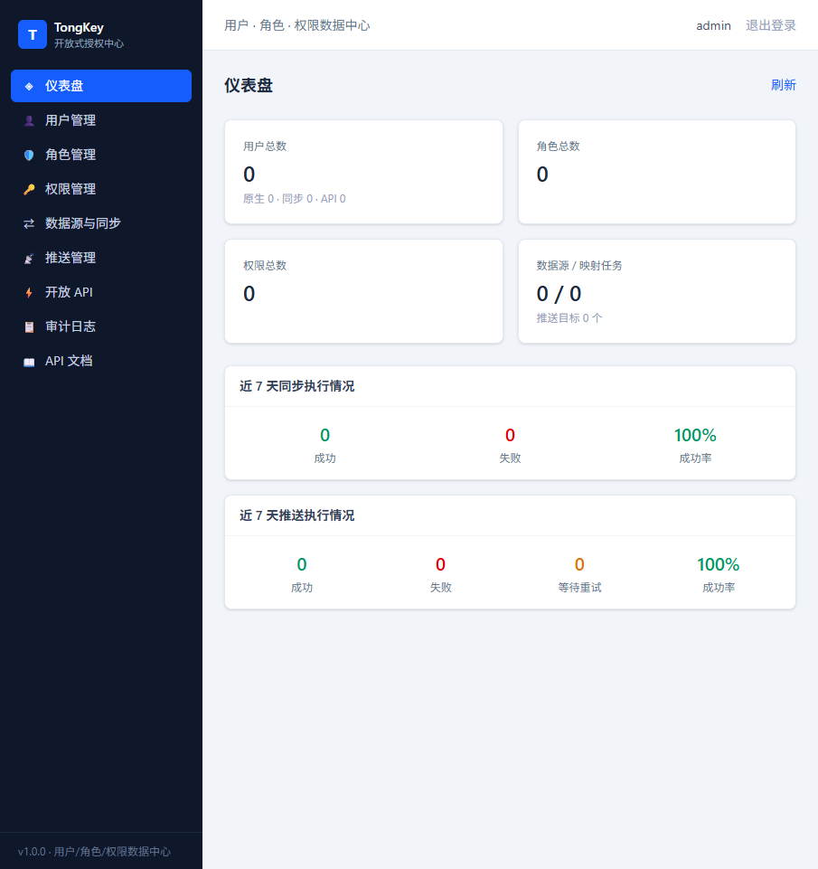

# TongKey Frontend

TongKey 开放式授权中心前端。基于 React 构建的管理控制台 + 内嵌 API 文档站点，与 [tongkey-backend](https://github.com/guwan/tongkey-backend) 配合使用。



## 技术栈

| 组件 | 技术 |
|---|---|
| 框架 | React 18 / TypeScript |
| 构建工具 | Vite 6 |
| 样式 | Tailwind CSS 4 |
| 路由 | React Router 6 |
| 数据请求 | TanStack Query 5 |
| 表单 | React Hook Form + Zod |
| 代码编辑器 | CodeMirror（SQL 编辑） |
| 包管理 | pnpm |

## 功能页面

- 📊 **仪表盘**：系统概览统计、关键指标
- 👤 **用户管理**：用户 CRUD、角色绑定
- 🛡️ **角色管理**：角色 CRUD、权限绑定
- 🔑 **权限管理**：权限树管理
- 📚 **数据源同步**：多数据源配置、手动/定时同步、同步日志
- 📤 **Webhook 推送**：推送目标管理、事件触发配置、推送日志
- 🔌 **开放 API 管理**：接入方创建、API Key 生成、scope 权限勾选、限流配置
- 📝 **审计日志**：操作记录查询
- 🔐 **登录**：管理控制台统一登录入口
- 📖 **文档站点（/docs）**：Quick Start、数据字典、Webhook 规范、Changelog

## 快速开始

### 环境要求

- Node.js 18+
- pnpm 9+（推荐 pnpm 11）

### 1. 安装依赖

```bash
pnpm install
```

### 2. 开发运行

```bash
pnpm dev
# 访问 http://localhost:5173
```

开发模式已配置 Vite 代理，以下路径自动转发到 `http://localhost:8080`：
- `/console/**` — 控制台 API
- `/api/**` — 开放 API
- `/v3/**`、`/swagger-ui/**` — OpenAPI 文档
- `/actuator/**` — 健康检查

### 3. 生产构建

```bash
pnpm build
pnpm preview   # 本地预览构建产物
```

### 4. 默认凭证

| 入口 | 地址 | 凭证 |
|---|---|---|
| 管理控制台 | `http://localhost:5173/` | admin / Admin@123 |
| 文档站点 | `http://localhost:5173/docs` | 无需登录 |

> ⚠️ 以上为后端默认值，**生产环境必须通过环境变量覆盖**（参见后端 README）。

## 目录结构

```
src/
├── main.tsx               # 应用入口
├── App.tsx                # 路由配置
├── index.css              # Tailwind 入口
├── api/                   # API 客户端（client.ts + types.ts + index.ts）
├── components/
│   ├── Layout.tsx         # 全局布局（侧边栏 + 顶栏）
│   └── ui.tsx             # 通用 UI 组件
├── pages/                 # 页面组件
│   ├── Login.tsx
│   ├── Dashboard.tsx
│   ├── Users.tsx
│   ├── Roles.tsx
│   ├── Permissions.tsx
│   ├── DataSources.tsx
│   ├── Push.tsx
│   ├── Clients.tsx
│   └── Audit.tsx
└── docs/                  # 内嵌文档站点（QuickStart / DataDictionary / WebhookSpec / Changelog）
```

## 开发注意事项

1. **pnpm 原生构建脚本**：Vite 的 `esbuild` 原生构建脚本需在 `pnpm-workspace.yaml` 中声明 `allowBuilds: esbuild: true`（适用于 pnpm 11）。
2. **路由守卫**：`App.tsx` 中无路径的守卫布局路由必须渲染 `<Outlet />`，否则登录后页面空白。
3. **后端启动顺序**：前端依赖后端 API，请先启动 [tongkey-backend](https://github.com/guwan/tongkey-backend)。

## 许可证

[MIT License](./LICENSE)
